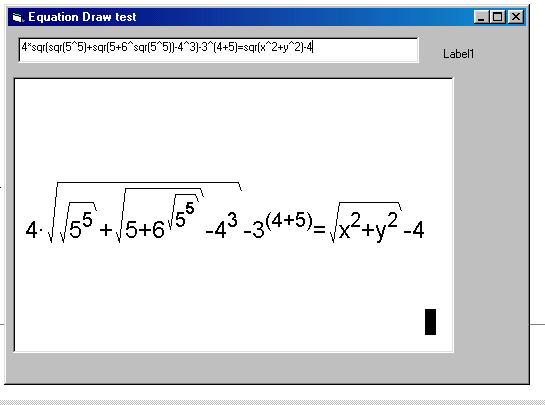



## Equation Drawer \(mathtype style\)

### Description

This test is a equation drawer. Unlike others on planet source code this one requires no syntax and the equation is automatically formatted into a picture box. Im hoping people will improve on it. So far, only the power and square root functions have been created but a fraction (over and under) will be soon. Plz sumbit ideas, bugs etc etc....

Features:

Accepts multiple powers, multiple sqrs and power of sqrs etc etc.
 
### More Info
 
sorry if it lacks a but of comments...i will add them soon, so if you want to modify this code and you dont know what something does...just email me.

             |
---                |---
**Submitted On**   |2003-02-15 12:49:32
**By**             |[Jazzor](https://github.com/Planet-Source-Code/PSCIndex/blob/master/ByAuthor/jazzor.md)
**Level**          |Advanced
**User Rating**    |4.6 (46 globes from 10 users)
**Compatibility**  |VB 5\.0, VB 6\.0
**Category**       |[Math/ Dates](https://github.com/Planet-Source-Code/PSCIndex/blob/master/ByCategory/math-dates__1-37.md)
**World**          |[Visual Basic](https://github.com/Planet-Source-Code/PSCIndex/blob/master/ByWorld/visual-basic.md)
**Archive File**   |[Equation\_D1548522222003\.zip](https://github.com/Planet-Source-Code/jazzor-equation-drawer-mathtype-style__1-43430/archive/master.zip)

